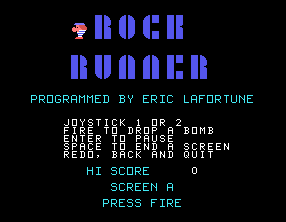
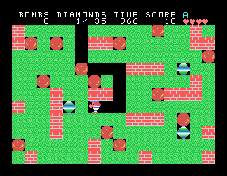
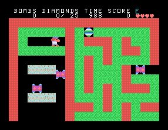
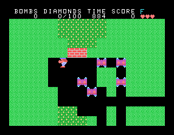
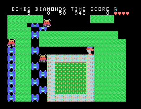
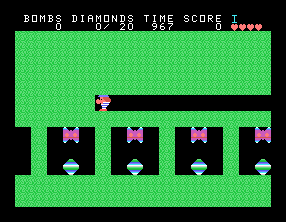
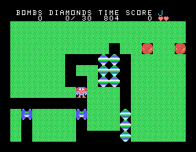
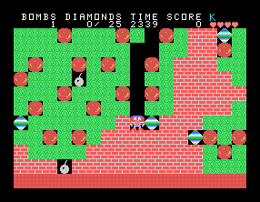
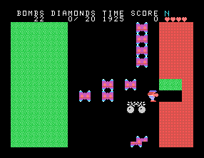
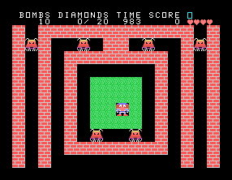

# Rock Runner

Rock runner is an action/exploration/puzzle game for the TI-99/4A home
computer, inspired by the game Boulder Dash on other platforms.
Collect diamonds in 2D worlds with stone, rocks, bombs, butterflies,
monsters, and lava.

## Features

* 15 challenging levels.
* Fast 4-directional scrolling.
* Introducing the colorful half-bitmap display mode.
* Sound and speech (with a speech synthesizer attached).
* Entirely written in TMS-9900 assembly code.
* The source code!

## Screenshots

## Requirements

* TI-99/4A home computer.
* Editor/Assembler module.
* 32K memory expansion.

or:

* An emulator for the TI-99/4A, like Mame.

## Building

You need to have the [xdt99](https://github.com/endlos99/xdt99)
cross-development tools installed, for the `xas99` assembler and the `xdm99`
disk manager.

On Linux, you can run the build script:

    ./build.sh

Alternatively, you can run its commands manually.

You'll then have the floppy disk image `out/rock.dsk`.

## Running

The easiest way is to use the Mame emulator.

On Linux, you can run the script to launch Mame with the proper options.
You still need the provide the path to your Editor/Assembler cartridge
image:

    ./run.sh EditorAssembler.rpk

Alternatively, you can run the Mamme command manually.

Once Mame is running and showing the TI-99/4A launch screen:

1. Press any key.
2. Press `2` for "Editor/Assembler".
3. Press `5` for "Run program file".
4. Enter `DSK1.ROCK` to run the executable from the mounted floppy.

The game then starts. You can select a screen with the joystick and `fire`
to start playing.

You can exit Mame by pressing `Insert` and then `Esc`.

## History

I wrote Rock Runner around 1986, using a basic TI-99/4A, a Mini Memory module
with 4K of battery-backed memory, a regular 32K memory expansion, and a
cassette tape recorder for external storage. The line-by-line assembler could
convert individual assembly instructions and write them straight to memory.
The memory editor then still allowed to edit a program as hexadecimal values,
manually changing opcodes and moving instructions and data around. Those were
the days!

Decades later, [Ralph
Benzinger](https://atariage.com/forums/profile/35214-ralphb/) 's excellent
[xdt99](https://github.com/endlos99/xdt99) cross-development tools allowed me
to disassemble the code. For the first time, I could see the source code of
my own program in full -- and so can you now. With all-new documentation,
the code is holding up pretty nicely. It can be a fun example of hand-written
assembly code for the TI-99/4A.

## License

Rock Runner is now released under the GNU General Public License, version 2.

Enjoy!

Eric Lafortune
